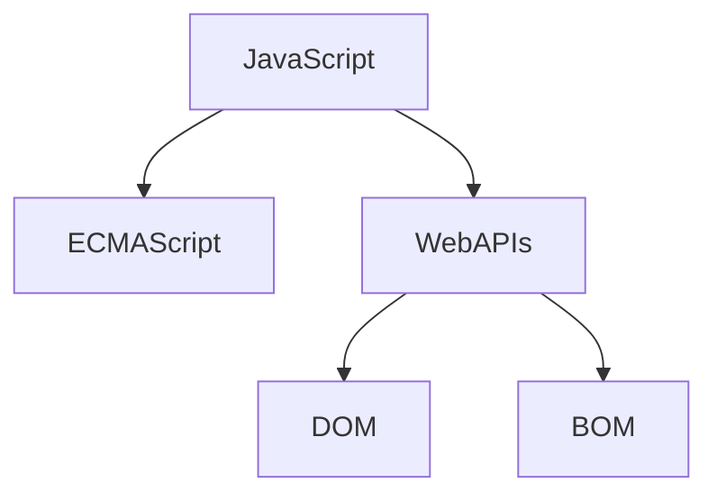

# Javascript基础
## 1 JavaScript初识
### 1.1 Javascript是什么
javascript的组成：

ECMAScript中定义了基础语法核心知识，比如变量，分支语句，循环语句，对象等等

Web APs:
- DOM 操作文档，比如对页面元素进行移动，大小，添加删除等操作
- BOM 操作浏览器，比如页面弹窗，检测窗口宽度，存储数据到浏览器等等

<a href="https://developer.mozilla.org/zh-CN/docs/Web/JavaScript">参考文档</a>

### 1.2 Javascript书写位置
JavaScript的每一行都是可以加分号和不加分号的，为了风格统一，要么每行都写，要么每行都不写，这里建议，全部省略
#### 1.2.1 内部javascript
直接写在html文件里面，使用script进行包住，**规范：script标签写在`</body>`的上面**。

<div style="border: 2px dashed yellow">
<span style="background-color: red">注意事项</span> <br>
我们将&ltscript&gt放在<span style="color: red">HTML文件的底部</span>附近的原因是浏览器会按照代码在文件中<span style="color: red">顺序加载</span>HTML。如果先加载JavaScript期望修改下面的HTML，可能会因为HTML未进行加载而发生失效。因此，将JavaScript的书写放在最下面是推荐的
</div>

#### 1.2.2外部JavaScript
代码书写在.js文件之中，然后使用scr方式进行引入

#### 1.2.3 行内引入js


### 1.3 JavaScript输入输出语法
#### 1.3.1 输出语法
- 文档输出内容`document.write('输出的内容，可以是html内容')`
- 控制台打印输出`console.log('内容打印在控制台')`
#### 1.3.2 输入语法
- `prompt('输入的内容')`，显示一个对话框，包含一条信息，用户可以输入文字

### 1.4 JavaScript的代码执行顺序
- 按照HTML文档顺序执行
- alert，prompt等会优先执行

### 1.5 子面量
literal，是计算机中描述的事/物

## 2.变量
### 2.1 变量是什么
略，所有的编程语言都是一样的

### 2.2 变量的基本使用
能够声明一个变量并完成赋值。
#### 2.2.1 变量的声明
`let x(变量)`
#### 2.2.2 变量的赋值
`x = 12`，这就是对声明出来的变量进行赋值
#### 2.2.3 变量的更新
`let x= 12 <br> x=13`即可，Javascript少用var，多用let，借鉴rust，一次声明后不能重复声明了。
### 2.3 变量的本质
略，和python这种编程语言一样
### 2.4 变量的命名规则和规范
#### 2.4.1 规则
- 不能使用关键字作为变量
- 只有下划线，字母，数字，$四种组成，不能使用数字开头
- 严格区分大小写
#### 2.4.2 规范
- 有意义的起名
- 使用小驼峰命名法

### 2.5 变量拓展
在较旧的javascript中会使用var，但是现在基本弃用了。var有诺干不合理的使用：
- 可以先使用，再声明
- var 声明过的变量可以重复声明
- 变量提升，全局变量，没有块级作用域等

#### 2.5.1 数组
使用方法`let 数组名 = [数据1， 数据2， ..., ]`，其实就是python的列表。

## 3.常量
- 概念：使用const声明的变量
- 使用场景：当某个变量永远不会发生改变的时候，就使用const来声明，而不使用let
- 命名规范：和变量一样（一般全大写）
- 注意：常量不允许重复赋值，声明的时候必须初始化

## 4.数据类型（js是弱数据类型语言）
### 4.1 基本数据类型
- number数字型
- string字符串型
- boolean布尔型
- underfined未定义型
- null空类型
#### 4.1.1 数字类型number
包括整数，浮点数，负数等，支持的操作有`+-*/%`，加减乘除取余数。和python一样会出现NAN，比如说你用字符串减去一个数字
#### 4.1.2 字符串类型
通过单引号''，双引号""，反引号``包裹的都叫字符串。js中推荐使用单引号。

js中进行字符串的拼接使用+号，类似于python

<div style="border: 2px dotted green">
<span style="background-color: red">模版字符串</span><br>
类似python，已经支持了格式化字符串`xxxx${变量}xxx`
</div>

#### 4.1.3 boolean类型
两个固定值true，false
#### 4.1.4 undefined
只声明了变量，但是没有赋值，就直接使用，这个值就是undefined。通过检测变量是不是undefined来判断后端有没有值过来
#### 4.1.5 null
null表示赋值了，但是值是空
### 4.2 引用数据类型
object
### 4.3 检测数据类型
使用`typeof 变量/typeof(变量)`来得到一个变量的类型

## 5 数据类型转换
使用表单，prompt获取过来的数据默认是字符串类型，需要进行类型转换
### 5.1 隐式转换
规则：
- 使用加号，只要两边有一边是字符串，则自动变成字符串拼接
- -*/，会转换成数字
- 加号作为正号的时候，会变成数字，如`+"123"`会得到123
### 5.2 显式转换
- 转换为数字类型Number(数据)，如果转换失败，则为NAN
- parseInt(数据)，只保留整数
- parseFloat(数据)，只保留浮点数

## 6 运算符
### 6.1 赋值运算符
能够使用赋值运算符简化代码，包括`+=, -=, *=, /=, %=`几种

### 6.2 一元运算符
根据表达式的个数，分为一元运算符，二元运算符，三元运算符。一元运算符：
- +-正负号
- ++，--，自增，自减，经常用来计数使用（和C语言一致，分x++，++x）

### 6.3 比较运算符
比较两个数是不是相等，大小：
- `>, <, >=, <=`，大于，小于，大于等于，小于等于
- `==`，比较两边值是不是相等，比如`2=='2'`返回true
- `===`，除了值要想等，类型也要相等，`2=='2'`返回false，推荐使用
- `!==`，两边是不是不全等

上述都是返回bool变量值

使用字符串进行比较，是通过asc码进行比较，尽量不要使用小数进行比较，会有精度的问题

### 6.4 逻辑运算符
与 `&&`，或`||`，非`!`

### 6.5 逻辑优先级
- 1.小括号()
- 2.一元运算符++ -- ！
- 3.算数运算符*/%+-
- 4.关系运算符 > >= <=
- 5.相等运算符 == != !== ===
- 6.先&&后||
- 7.赋值=
- 8.逗号

## 7. 语句
### 7.1 表达式和语句
- 表达式：因为表达式可以被求值，所以它在等号的右边
- 语句：不一定有值，比如alert(), for, break。程序有三大流程语句：顺序结构，分支结构，循环结构

### 7.2 分支语句
#### 7.2.1 if语句
使用方法：单分支，双分支，多分枝，使用方式：
```javascript
// 单分支
if(condition){
    //执行语句
}
```
```javascript
// 双分支
if(condition){
    // 分支1
}else{
    // 分支2
}
```
```javascript
//多分支
if(condition1){
    // 代码1
}else if(condition2){
    // 代码2
}else{
    // 条件1和条件2都不满足，进入
}
```
对于数字来说，除了0都是真，对于字符串，除了空字符串都为真

#### 7.2.2 三元运算符
使用场景：其实是比if双分支更简单的写法`condition ？ code_1 : code_2`，一般用来取值

#### 7.2.3 switch语句
使用方法：
```javascript
switch(数据){
    case 值1:
        //语句
        break
    case 值2:
        // 语句
        break
    default
        // 语句
        break
}
```
switch一般适用在等值判断，不适合在区间判断中

### 7.3 循环语句
`continue, break`分别表示跳过此次循环，以及循环直接结束
#### 7.3.1 while循环
```javascript
while(循环条件){

}
```
#### 7.3.2 for循环
```javascript
for(变量起始值；终止条件；变量变化){
    // 函数体
}
```

```javascript
for(第一层变量的初始值; 第一层变量的终止条件; 第一层变量的变化条件)
    {
        for(第二层变量的初始值; 第二层变量的终止条件; 第二层变量的变化条件){
            // 内层循环
        }
    }
```

## 8. 数组（和C语言基本一致）
### 8.1 数组的基本使用
`let arr = [1,2,3,4]`

`let arr = new Array(1,2,3,4)`

建议使用第一种方式
#### 8.2 数组的增删改查操作
- 索引从0开始，查找就是通过下标的方式查找`arr[0]`
- 赋值，`arr[0] = 新值`
- 增加，`arr.push(新增的内容), arr.unshift(新增的元素)`，一个是从后面加，一个从前面加，都可以一次性添加多个元素，返回扩充的新数组
- 删除，`arr.pop(), arr.shift(), arr.splice(start, deleteCount)`，删掉最后一个值，并且返回那个值；删掉第一个值；起始位置，需要删掉元素的个数，如果不写则从start开始直接删除到末尾（返回一个array）

## 9. 函数
函数的声明语法
```javascript
function 函数名(){
    // 函数体
}
```
命名规范：
- 和变量命名基本一致
- 尽量使用小驼峰
- 开始的第一个词为动词

### 9.1 函数传参
```javascript
function 函数名(args1, args2){
    // 和其他编程语言一样，可一个给参数默认值args1=0 , args2 = 0
}
```

### 9.2 函数的返回值
`return`即可，如果需要返回多个值就使用`[return_value1, return_value2]`

### 9.3 函数的作用域
全局作用域和局部作用域，函数外的变量，函数内部能用。函数内部的变量，函数外部不能使用

### 9.4 匿名函数
~~~javascript
function(){}
~~~
#### 9.4.1 函数表达式
将一个函数赋值给一个变量，如`let x = function(){}`，后续使用就是`x()`即可

#### 9.4.2 立即执行函数
避免全局变量之间的污染
```javascript
(function(行参){函数体})(实参);
//(写一个函数)(调用)
// 立即执行函数尾部必须要加分号
(function(行参){函数体}(实参));
// 第二种立即执行函数的方式
```
当然，立即执行函数也是可以赋一个函数名的，如：

```javascript
((function fn(){})())
```

#### 9.4.3 逻辑中断
只存在与&&和||中，对于&&而言，如果左边为false，右边直接不执行。对于||而言，如果左边为true，右边不执行，直接返回true

对于&&而言，如果两个值都是真，则返回最后一个真值；对于||而言，如果两个值都是真，则返回第一个真值，如果两个都是假值，则返回最后一个值

#### 9.4.4 转换为boolean型
'', 0, underfined, null, false, NAN变成bool都是false，其余为true，`Boolean(x)`
