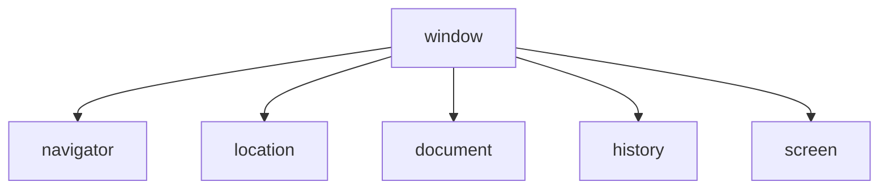

# WebAPI
## 1. WebAPI初识
### 1.1 作用和分类
作用：使用js去操作html和浏览器 <br>
分类：DOM(文档对象模型)，BOM(浏览器对象模式)

### 1.2 DOM
document object model：开发网页内容特效和实现用户交互
### 1.3 DOM树
- 将HTML标签以树状结构直观的表现出来
- 描述网页内容的名词
- 作用：文档树直观的体现了标签与标签之间的关系
#### 1.4 DOM对象
- DOM对象：浏览器根据HTML标签生成的JS对象
  - 所有的属性标签都可以在这个对象上找到
  - 修改这个对象的属性会自动映射到标签身上
- DOM的核心思想
  - 把网页内容当做对象来处理
- document对象
  - 是DOM里提供的一个对象
  - 所以它提供的属性和方法都是用来访问和操作网页内容的`document.write()`
  - 网页所有内容都在document里面

## 2 获取DOM对象
根据css选择器的方式获取DOM对象
### 2.1 根据css选择器获取DOM对象
- 选择匹配的第一个元素`document.querySelector('css选择器')`
- 选择多个元素`docuement.querySelectorAll('css选择器')`，返回的一定是一个伪list

### 2.2 操作元素的内容
- 对象.innerText(修改标签内的文本，不解析标签)
- 对象.innerHTML(修改标签内的html，建议使用模板字符串)

### 2.3 操作元素的属性
使用querySelector选择出来某一个标签对象，然后使用.操作修改内部的属性，如``，然后使用`const img = document.querySelector('img')`得到这个对象，通过`img.src = xx`即可更换图片

### 2.4 修改元素的css
通过`object.style.attr`方式修改边框的颜色

### 2.5 通过类名来修改样式
```javascript
<style>
    .box{
        width: 100px
    }
</style>
<div></div>
// 通过给div增加类名box来修改css样式
<script>
    const div_object = document.querySelector('div')
    /* 这里使用className是因为class是关键字 */
    div_object.className = 'box'
</script>
```
### 2.5 通过classList操作类控制css（追加写入）
```javascript
.class1 {
    xxx:xxx
    }

.class2{
    sss:sss
    }
<div class="class1"></div>
<script>
    const div = document.querySelector('div')
    div.classList.add('class2')
    {/* div.classList.remvoe('class1'),删除class1类 */}
    {/* div.classList.toggle('class2'),如果div有class2这个类就删除，没有就添加 */}
</script>
```
### 2.6 操作表单元素属性
- 表单很多情况，也需要修改属性，比如点击眼睛，可以看到密码，本质是把表单类型转换为文本框
- 正常的有属性有取值的 跟其他的标签属性没有任何区别
- 表单属性添加就有效果，移除就没有效果，一律使用bool值表示

### 2.7 自定义属性
- 标准属性：标签天生自带的属性，比如class id title等，可以直接使用点语法操作，比如：disabled，checked，selected
- 自定义属性：
  - 在html5中推出了专门的data-自定义属性
  - 在标签上一律以data-开头
  - 在DOM对象上一律以dataset对象方式获取

### 2.8 定时器-间歇函数
网页中经常会出现：每隔一段时间需要自动执行一段代码

<div style="background-color: white">
  setInterval(function(){}, 1000)， 每隔1s执行一下前面的匿名函数
</div>

关闭定时器
```javascript
let n = setInterval(fn, 1000)
clearInterval(n)
```
当然一般不会这么做，在实际的应用中，都是鼠标经过事件定时器关闭，移开之后重新开启

## 3. 事件
### 3.1 事件监听
目标：能够给DOM元素添加事件监听
- 什么是事件
  - 事件是在编程时系统内发生的动作或者发生的事情，比如用户在网页上单击一个按钮
- 什么是事件监听
  - 就是让程序检测是否有事件产生，一旦有事件触发，就立即调用一个函数做出response，也称为绑定事件或者注册事件，比如鼠标经过显示下拉菜单

语法：
```javascript
元素对象.addEventListener('事件类型', 要执行的函数)
```
### 3.2 事件监听版本
- DOM L0 事件源.on事件 = 匿名函数
- DOM L1 元素对象.addEventListener('事件', 匿名函数)
- 区别，on方式会被覆盖，addEventListener方式可以绑定多次，拥有事件更多特性

### 3.3 事件对象
- 鼠标事件
  - click 鼠标点击
  - mouseenter 鼠标移动
  - mouseleave 鼠标离开
- 焦点事件
  - focus 获得焦点
  - blur 失去焦点
- 键盘事件
  - keydown 键盘按下触发
  - keyup 键盘抬起触发
- 文本事件
  - input 用户输入事件

- 事件对象
  - 也是个对象，这个对象里面有事件触发时候的相关信息
  - 例如：鼠标点击事件中，事件对象就存了鼠标点在哪个位置等信息
- 使用场景
  - 可以判断用户按下哪个键，比如按下回车键可以发布新闻
  - 可以判断鼠标点击了哪个元素，从而做相应的操作
  - 在回调函数中的第一个参数就是事件对象
  - 在事件绑定的回调函数的第一个参数就是事件对象，也就是写在`addEventListener('click', function(e){})`，其中e就是事件对象
- 常见的属性
  - type，事件的类型
  - clientX/clientY获取事件的位置，相对于浏览器左上角而言
  - offsetX/offsetY获取事件的相对位置，相对于当前DOM元素左上角的位置
  - key用户按下键盘的值

### 3.4 环境变量
指的是函数内部特殊的变量this，每一个函数内部中都会有this对象，哪个对象调用这个函数，this就是指向谁

## 4. 事件
### 4.1 事件流
事件流和两个阶段说明：
- 事件流指的是事件完整执行过程中的流动路径（简单来说，捕获是从父到子，冒泡是从子到父）
### 4.2 事件捕获
 从dom的根元素开始执行，从外到里执行（基本不用了）

### 4.3 事件冒泡
当一个元素被触发之后，会依次向上调用所有父级元素的同名事件，事件冒泡是默认存在的

### 4.4 阻止冒泡
问题：默认有冒泡模式的存在，所有容易导致事件影响到父亲元素

需求：弱想要把事件就限制在当前元素内，就需要阻止事件冒泡

前提：阻止事件冒泡需要拿到事件对象

语法：`事件对象.stopPropagation()`，这个方法可以阻断事件流动传播，不光在冒泡阶段有效，捕获阶段也有效

### 4.5 解绑事件
使用null覆盖掉原来的事件，在on方法添加事件的方式，L0写法， 使用`addEventListener`添加的事件目前使用的是`removeEventListener(事件，方法)`，注意，使用匿名函数无法这样解绑

### 4.6 鼠标经过事件的区别
- mouseover和mouseout会有冒泡效果（弃用）
- mouseenter和mouseleave没有冒泡效果

### 4.7 两种注册事件的区别
- 传统on注册（L0）
  - 统一个对象，后面注册的事件会覆盖前面注册（同一事件）
  - 直接使用null覆盖就可以实现事件的解绑
  - 都是冒泡阶段执行的
- 事件监听注册（L2）
  - 语法：addEventListener（事件类型，事件处理函数，是否使用捕获）
  - 后面注册的事件不会覆盖前面注册的事件
  - 可以通过第三个参数去确定是在冒泡或者捕获阶段执行
  - 必须使用removeEventListener（事件类型，事件处理函数，获取捕获或者冒泡阶段）
  - 匿名函数无法被解绑

### 4.8 事件委托
事件委托是利用事件流的特征解决一些开发需求的知识技巧
  - 优点：减少注册次数，可以提高程序性能
  - 原理：事件委托其实是利用事件冒泡的特点
    - 给父元素注册事件，当我们触发子元素的时候，会冒泡到父元素身上，从而触发父元素的事件
  - 实现：使用tagName获取得到标签名字，如`LI, P, A`等，标签是全大写的

### 4.9 阻止默认行为
某些情况下需要阻止默认行为，比如跳转，转发等，添加事件`e.preventDefault()`即可

### 4.10 其他事件
#### 4.10.1 页面加载事件
加载外部资源（如图片，外联css和js等）加载完毕时触发的事件，事件名：load

监听页面所有资源加载完毕：给window加载load事件，如`window.addEventListener('load', function(){})`，当然不光可以监听整个页面资源加载完毕，也可以针对某个资源绑定load事件，比如说`img.addEventListener('load', function(){})`这就是当图片加载完毕后执行callback函数

当初始的HTML文档被完全加载和解析完成之后，DOMContentLoaded事件被触发，而不需等待样式表，图像等完全加载，给document添加的事件`document.addEventListener('COMContentLoaded', function(){})`
#### 4.10.2 元素滚动事件
- 滚动条在滚动的时候持续触发的事件
- 很多网页需要检测用户把网页滚动到某一个区域后做一些处理，比如固定导航栏，比如返回顶部
- 事件名  scroll
- 监听整个页面滚动`window.addEventListener('scroll', function(){})`
- 监听某个元素的内部滚动直接给某个元素加即可
- 页面滚动事件，获取位置
  - scrollLeft和scrollTop
    - 获取被卷去的大小
    - 获取元素内容往左，往上滚出去看不到的距离
    - 这两个值是可读写的
    - 获取方式`对象.scrollTop`
- 获取页面的html，`document.documentElement`
- 只要获取body， `document.body`
- 使用scrollTo(x,y)滚动到指定坐标
#### 4.10.3 页面尺寸事件
会在窗口尺寸改变的额时候触发事件

## 日期
### 5.1 日期对象
掌握日期对象，可以让网页显示日期
- 用来表示时间的对象
- 可以得到当前系统时间

#### 5.1.1 日期对象的实例化
- 在代码中使用new关键字
- 创建一个时间对象并获取时间`new Date()`
- 获取指定时间`new Date('2011-9-10')`，倒计时使用

#### 5.1.2 日期对象的方法
- `getFullYear()`，获取年份
- `getMonth()`，获取月份,从0-11，实际使用需要+1
- `getDate()`，获取月份中的每一天
- `getDay()`，获取星期几，从0-5
- `getHours()`获取小时，从0-23
- `getMinutes()`获取分钟，从0-59
- `getSeconds()`获取秒，从0-59

#### 5.1.3 时间戳
- 使用场景：如果计算倒计时效果，前面方法无法直接计算，需要借助于时间戳完成
- 算法：
  - 将来的时间戳-减去现在的时间戳 = 剩余时间的毫秒数
  - 剩余时间毫秒数转换为剩余时间的年月日时分秒就是倒计时间
  - 使用`getTime()`获取时间戳，或者使用+进行数据类型转换，或者使用`Date.now()`

### 5.2 节点操作
#### 5.2.1 DOM节点
- DOM树里每一个内容都称之为节点
- 节点类型
  - 元素节点：
    - 所有的标签，比如body，div
    - html是根节点
  - 属性节点
    - 所有的属性，比如href
  - 文本节点
    - 所有的文本
  - 其他

#### 5.2.2 节点的增删改查
通过关系来操作
- 寻找父节点`parentNode`，寻找到的最近的父级节点，返回dom对象
- 兄弟关系查找：
  - childNodes,获取所有子节点，包括文本节点，空格，换行，注释节点等
  - children属性，仅获取所有元素节点，返回的还是一个伪数组
  - nextElementSibling，下一个兄弟，previousElementSibling，上一个兄弟

增加节点：分成创建节点，然后插入节点
- 使用`createElement`进行创建节点
- 使用`父元素.appendChild(新标签)`进行追加，插入到父元素的最后一个元素，使用`父元素.insertBefore(要插入的元素，在哪个元素前面)`
- clone节点，`元素.cloneNode(布尔值)`深拷贝
- 删除节点,`父元素.removeChild(子元素)`


## 6 BOM
### 6.1 window对象
#### 6.1.1 BOM
浏览器对象模式，显然BOM包含DOM


- window对象是一个全局对象，是js中的顶级对象
- 如document,alert(), console.log()都是window的属性，基本BOM的属性和方法都是window的
- 所有通过var定义在全局作用域中的变量，函数都会变成window对象的属性和方法
- window对象下的属性和方法调用的时候可以省略window

#### 6.1.2 定时器-延时函数
- js内置的一个用来让代码延迟执行的函数，叫setTimeout，`setTimeout(callback_fn, 等待的毫秒数)`,只执行一次
- 清除延时函数，`clearTimeout()`

#### 6.1.3 js执行机制
js语言是单线程，同一个时间就只能做一件事。比如我们对某个DOM元素进行添加和删除操作，不能同时操作。为了解决这个问题，利用多核cpu的计算能力，HTML5提出web worker标准，允许js脚本创建多个线程，于是，js有同步和异步
- 同步任务：所有同步任务都在主线程上执行，形成一个执行栈
- 异步任务：js的异步通过回调函数实现的，一般而言，异步任务有三种类型：
  - 普通事件，如click，resize等
  - 资源加载，如load，error等
  - 定时器，包括setInterval，setTimeout
异步任务相关添加放在消息队列中


js先执行栈中的同步任务，异步任务放在任务队列中。一旦执行栈中的所有同步任务执行完毕，系统就会按次序读取任务队列中的异步任务，于是被读取的异步任务结束等待状态，进入执行栈，开始执行

### 6.2 location对象
- location的数据类型是对象，包括页面的html以及响应的资源
- href就是url，可以支持修改，让页面自动跳转
- 使用location.search()可以获取表单的相关信息，得到的是?后面的东西
- 使用location.hash()获取#后面的内容
- reload方法，用来刷新当前页面，传入参数true进行强制刷新

### 6.3 history对象
主要是管理历史的，常用的属性和方法：
- back()后退功能
- forward()前进功能
- go(参数),参数为正就是前进，负数就是后退

### 6.4 本地存储
就是将数据存在本地的浏览器中，等下次直接开始可以本地读取，速度很快
#### 6.4.1 localstorage（关闭浏览器不消失）
- `localStorage.setItem(key, value)`，存数据，无论放什么都会变成字符串
- `localStorage.getItem(key, value)`, 查找数据
- `localStorage.removeItem(key)`， 删除数据
- 修改数据，依旧使用setItem，覆盖旧值

#### 6.4.2 sessionStorage(关闭浏览器消失)，用法和localStorage一模一样


#### 6.4.3 本地存储复杂数据类型
需要将对象用json序列化变成字符串进行存储，`JSON.stringify()`，第二步就是将这个json进行反序列化`JSON.parse()`


#### 6.4.4 拓展方法
`arr.forEach(callback(element, index){})`，回调函数是没有返回值的，遍历用的
`arr.map(callback(element, index){})`，使用map会返回一个新数组，对列表中的每一个元素执行相同操作
`arr.join('连接字符')`，将arr中的每一个元素使用链接字符链接

## 7. 正则表达式
正则表达式是用于匹配字符串中字符组合的模式，在js中，正则表达式也是对象。语法：
- `const 变量名 = /表达式/`
- `test()`方法，使用方式`regObj.test(被检测的字符串)`，返回的结果是bool

### 7.1 元字符
具有特殊含义的字符，也就是python中的通配符。比如说[a-z]则表示只能输入a-z之间的字符。分类：
- 边界符（表示位置，开头和结尾，必须用什么开头，用什么结尾）
  - `^`表示匹配行首的文本（以谁开始）
  - `$`表示匹配行位的文本（以谁结束）
- 量词（表示重复的次数）
  - `*`表示重复零次或多次
  - `+`表示重复一次或多次
  - `?`表示重复零次或者一次
  - `{n}`表示重复n次
  - `{n,}`表示重复n次或者更多次
  - `{n,m}`表示重复n次到m次
- 字符类
  - `[]`,只要包含在中括号中的任意一个都是true
  - `-`，使用连字符，可以表示范围
  - 预定义类
    - \d，相当于[0-9]
    - \D，相当于[^0-9]
    - \w，相当于[a-zA-Z0-9]
    - \W，相当于[^a-zA-Z0-9]
    - \s 匹配空格
    - \S 匹配非空字符
