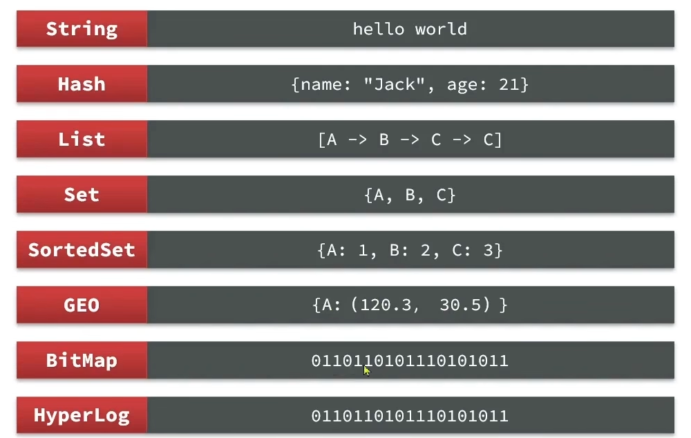
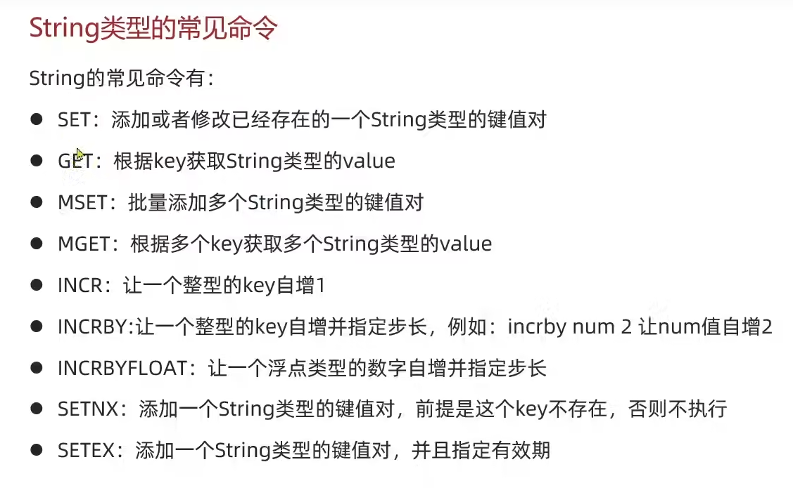
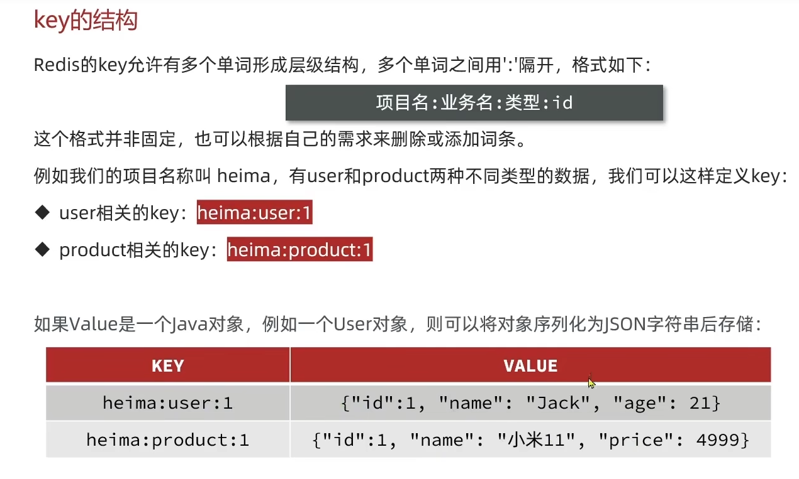
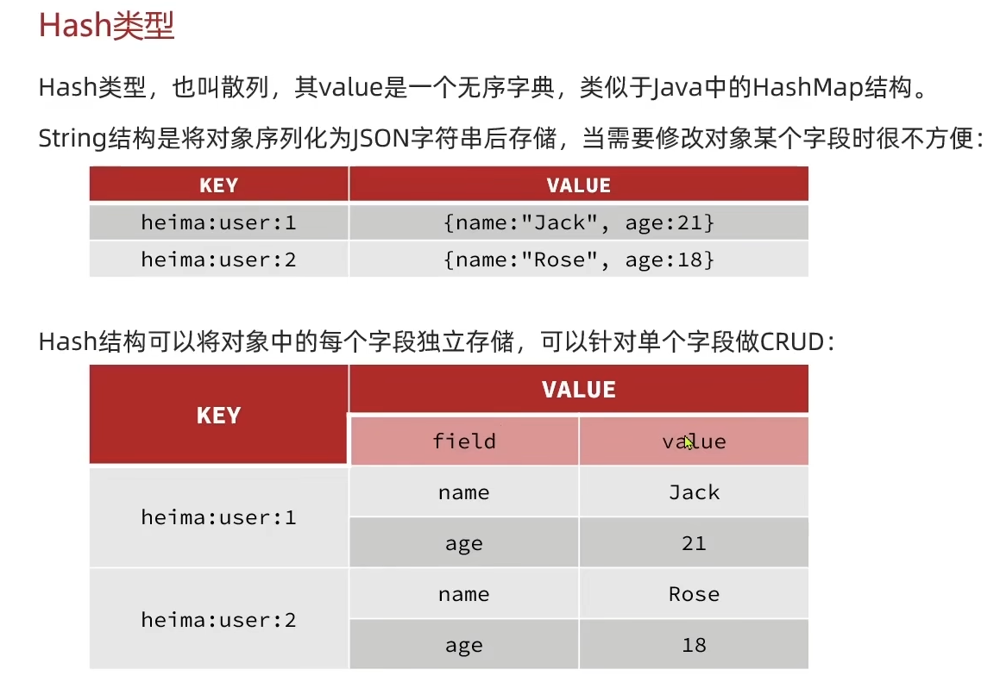
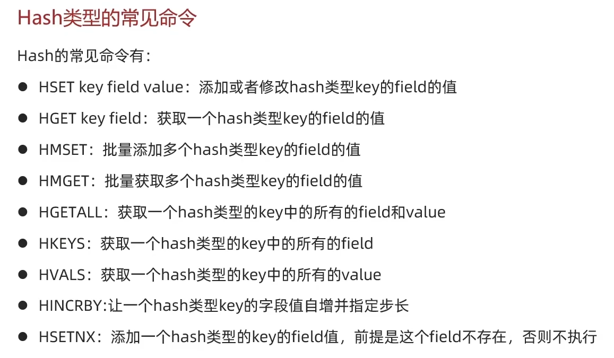
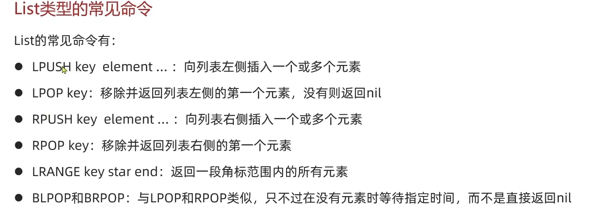
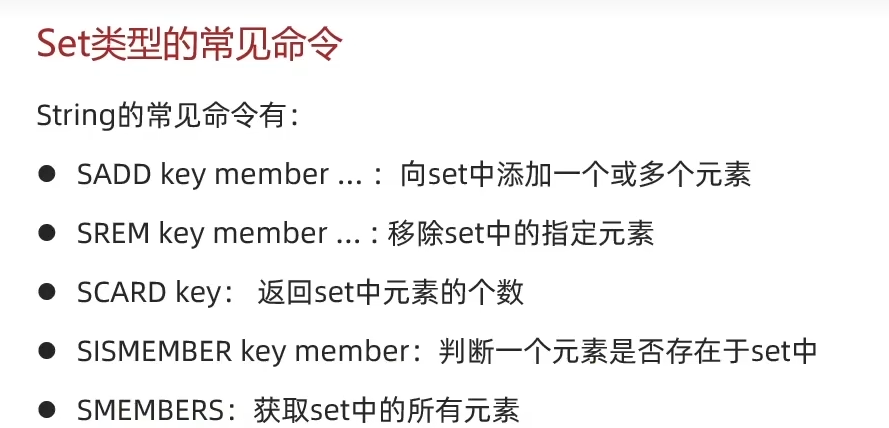
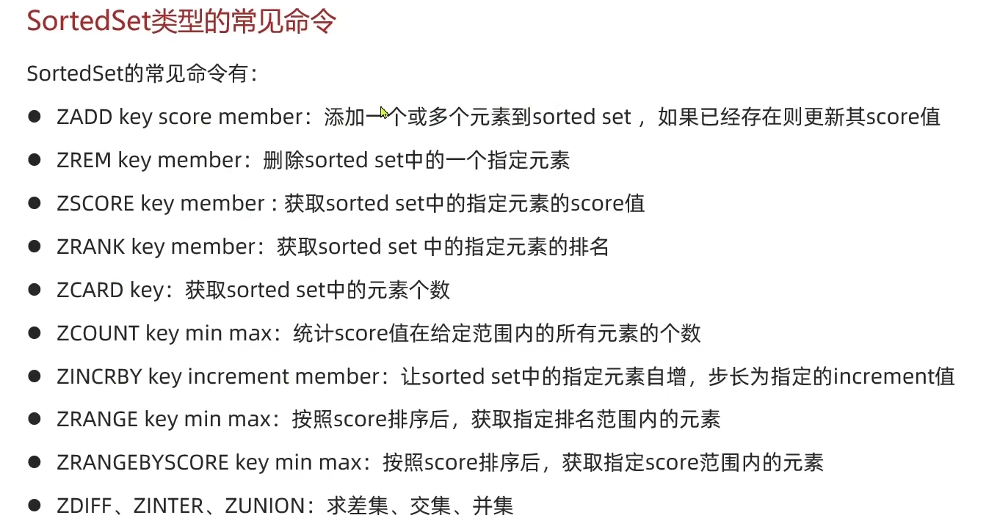

# 1 配置文件
- `bind`默认是`127.0.0.1`表示只允许本地访问
- `daemonize`，修改为yes表示后台运行

# 2 redis的数据结构

# 3 redis的通用命令
- `keys`，查询当前db中所有的key，不建议在生产环境设备上使用
- `del`，删除一个key，两种使用，`del key`，单独删除一个，如果是`del key1 key2`就删除两个，以此类推
- `exists`，判断一个key是不是存在
- `expire`，给一个key设置有效期，到了时间key会自动被删除
- `ttl`，查看一个key的有效期，如果是-2就是删除，-1是永久

# 4 string类型
最简单的存储类型，根据字符串的格式不同，可以分成三类：
- string：普通字符串
- int：整数类型，可以自增，自减
- float：浮点类型，同int
一个字符串类型的最大空间不超过512m

## 4.1 常见的命令

## 4.2 key的结构

从这个图可以看出来，如果想要讲对象存进来，必须先序列化成一个json字符串。当然，redis也支持多级存储，其实就是多级字典fltten之后

## 4.3 hash类型

## 4.4 hash命令

## 4.4 List类型
可以看做是一个双向链表结构，既可以支持正向检索也可以支持反向检索，特征有：
- 有序
- 元素可以重复
- 插入和删除快
- 查询速度一般

## 4.5 set 类型
可以看成value为null的hashmap，特征为：
- 无序
- 元素不可以重复
- 查找快
- 支持交集，并集，差集等功能

此外还有交，差，补三种
- `sinter`
- `sdiff`
- `sunion`

## 4.6 sortedset 类型
sortedset中的每一个元素都带有一个score属性，可以基于score对元素进行排序，底层的实现是一个跳表加hash表，sortedset具备下列特征：
- 可排序
- 元素不重复
- 查询速度快

常见的命令

